# Automated Deployment with Jenkins, Docker, Kubernetes, and Git

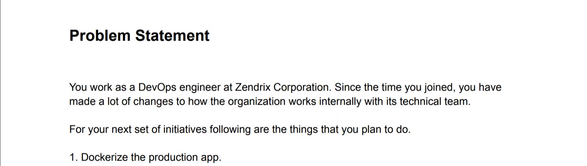


### Dockerize the production app


### **Use Kubernetes to deploy this app**


### Create a Jenkins freestyle pipeline to deploy the latest version of the app the moment there is a change on the GitHub repo

Webhooks typically require a publicly accessible domain name to receive incoming requests, need to run pipeline manually here.

### **Test the website at port 85, to verify the app is working. If the test case is passed, the the application will be deployed on Kubernetes.**

```bash
nilesh@ubuntu:~/DevOpsProfessional$ kubectl apply -f service.yaml
The Service "apache-service" is invalid: spec.ports[0].nodePort: Invalid value: 85: provided port is not in the valid range.
The range of valid ports is 30000-32767
```

### **Create a new pipeline to deploy the application on Kubernetes using your custom image of the application from Docker hub. Make sure your application is visible as a NodePort Service.**


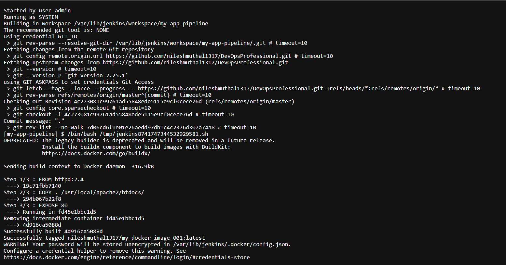

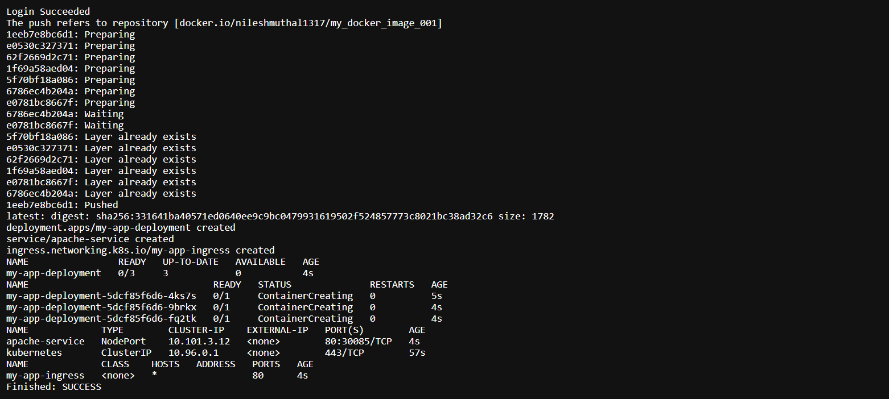

### **Jenkins Build Steps**

```bash
#!/bin/bash
# make sure minikube is running at backend
# Build Docker image

docker build -t nileshmuthal1317/my_docker_image_001:latest .

# Login to Docker Hub using Jenkins credentials

echo $DOCKER_HUB_PASSWORD | docker login -u nileshmuthal1317 --password-stdin

# Push Docker image to Docker Hub

docker push nileshmuthal1317/my_docker_image_001:latest

# Set kubeconfig environment variable

export KUBECONFIG=/var/lib/jenkins/.kube/config

# Apply Kubernetes manifests

kubectl apply -f deployment.yaml
kubectl apply -f service.yaml
kubectl apply -f ingress.yaml

# Verify deployment status

kubectl get deployment
kubectl get pods
kubectl get services
kubectl get ingress
```

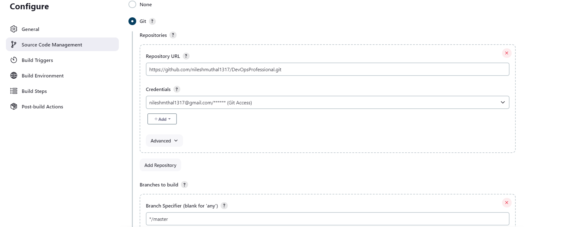

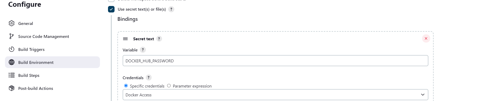

### Authenticate Jenkins to use MiniKube

We need to copy certain files from the `.minikube` directory to Jenkins and update their permissions accordingly.

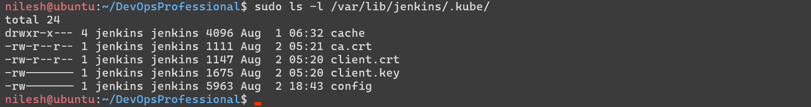

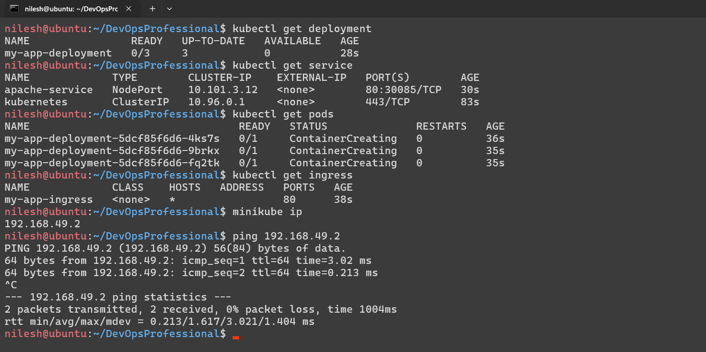

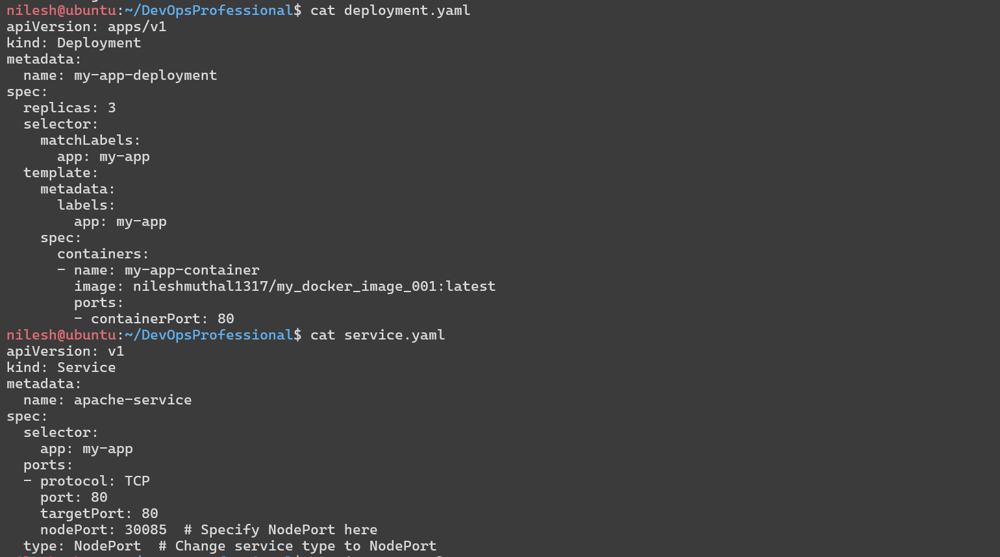

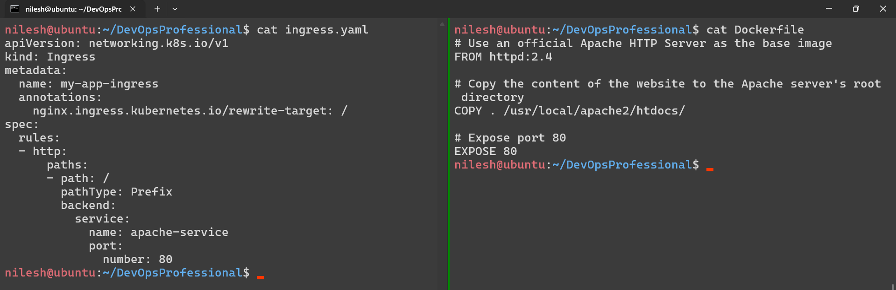

### **Create the required infrastructure using Terraform and Install Java on machines using Configuration Management Tool(Ansible)**

### **Terraform**

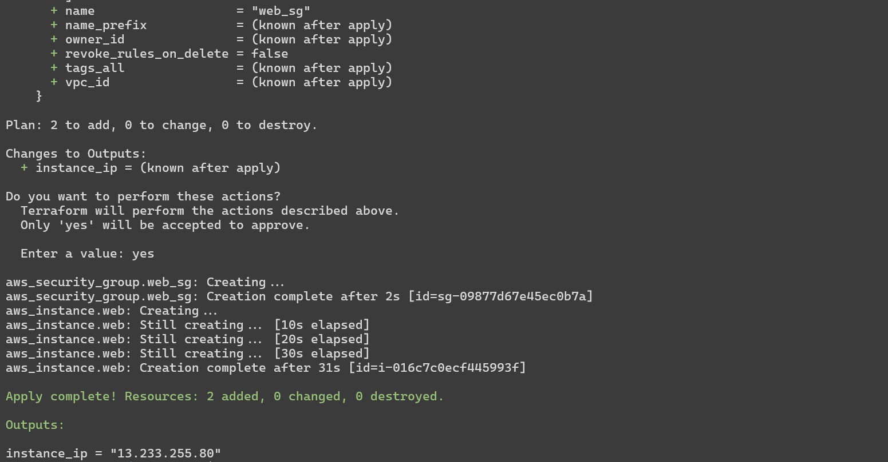

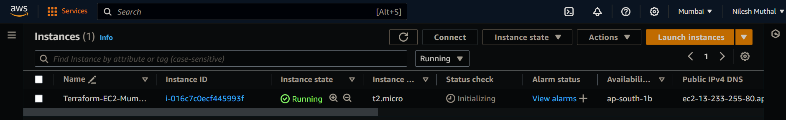

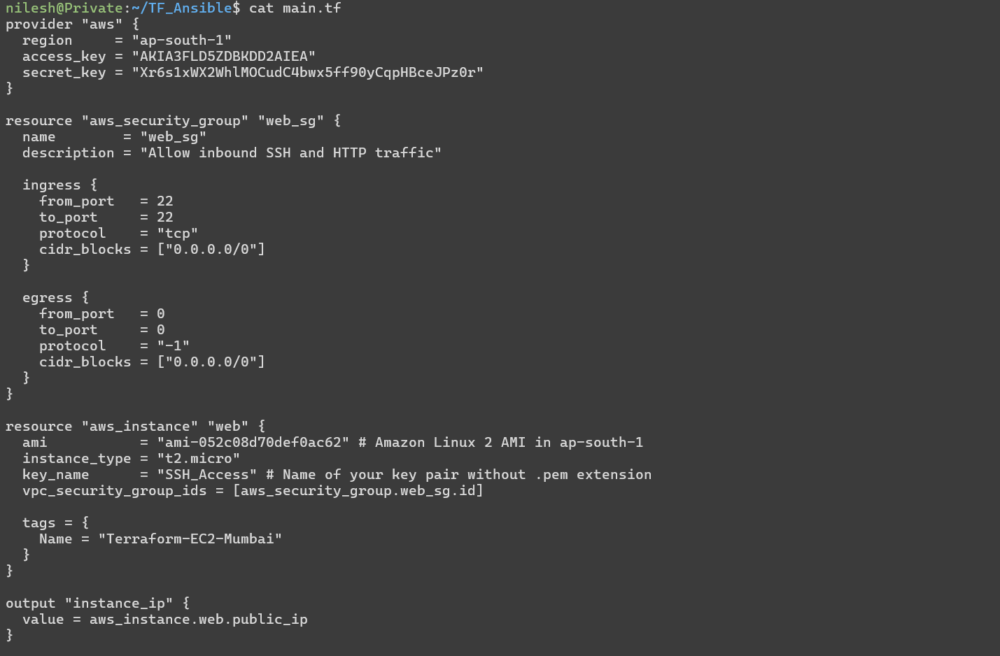

### **Ansible**

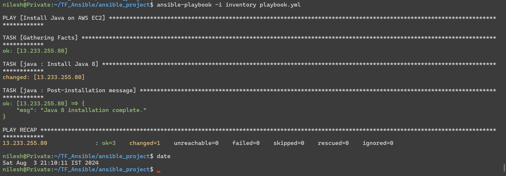

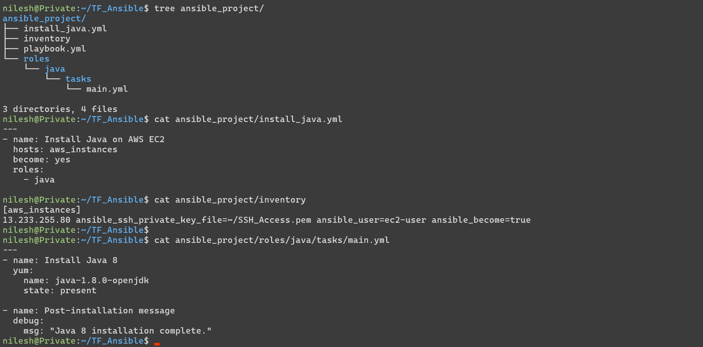

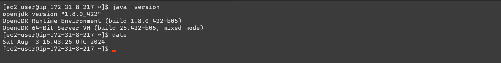