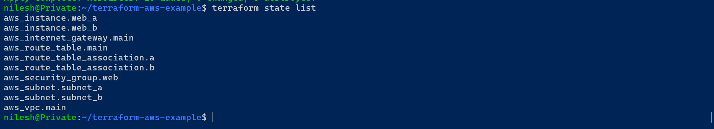
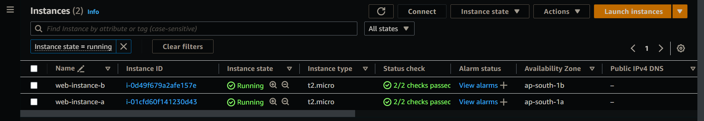
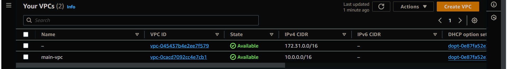
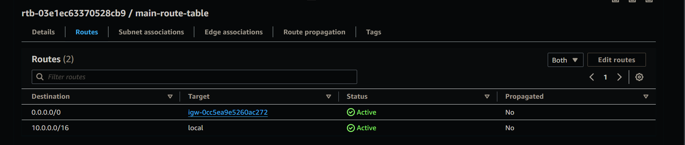
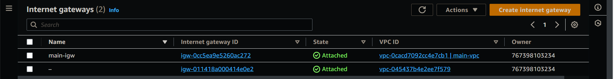
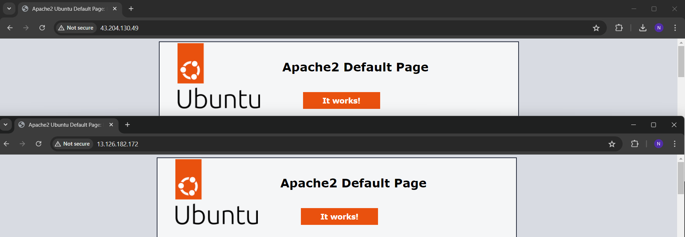

# AWS VPC and EC2 Infrastructure with Terraform

## **Project Description**

This project demonstrates how to use Terraform to automate the deployment of an AWS Virtual Private Cloud (VPC) and create subnets, an internet gateway, route tables, security groups, and EC2 instances with a running Apache web server.

## **Project Resources**

- VPC with a /16 CIDR block
- Two subnets in different availability zones
- Internet Gateway for public access
- Route Table and association with subnets
- Security Groups for web and SSH access
- EC2 instances in each subnet running Apache

## **Terraform Configuration**

```json
# main.tf

# Configure the AWS Provider

provider "aws" {
region = "ap-south-1"
access_key = " access_key"
secret_key = " secret_key"
}

# Create VPC

resource "aws_vpc" "main" {
cidr_block = "10.0.0.0/16"
tags = {
Name = "main-vpc"
}
}

# Create Subnets

resource "aws_subnet" "subnet_a" {
vpc_id            = aws_vpc.main.id
cidr_block        = "10.0.1.0/24"
availability_zone = "ap-south-1a"
tags = {
Name = "subnet-a"
}
}

resource "aws_subnet" "subnet_b" {
vpc_id            = aws_vpc.main.id
cidr_block        = "10.0.2.0/24"
availability_zone = "ap-south-1b"
tags = {
Name = "subnet-b"
}
}

# Create Internet Gateway

resource "aws_internet_gateway" "main" {
vpc_id = aws_vpc.main.id
tags = {
Name = "main-igw"
}
}

# Create Route Table

resource "aws_route_table" "main" {
vpc_id = aws_vpc.main.id
route {
cidr_block = "0.0.0.0/0"
gateway_id = aws_internet_gateway.main.id
}
tags = {
Name = "main-route-table"
}
}

# Associate Route Table with Subnets

resource "aws_route_table_association" "a" {
subnet_id      = aws_subnet.subnet_a.id
route_table_id = aws_route_table.main.id
}

resource "aws_route_table_association" "b" {
subnet_id      = aws_subnet.subnet_b.id
route_table_id = aws_route_table.main.id
}

# Create Security Group

resource "aws_security_group" "web" {
vpc_id = aws_vpc.main.id
ingress {
from_port   = 80
to_port     = 80
protocol    = "tcp"
cidr_blocks = ["0.0.0.0/0"]
}

ingress {
from_port   = 22
to_port     = 22
protocol    = "tcp"
cidr_blocks = ["0.0.0.0/0"]
}

egress {
from_port   = 0
to_port     = 0
protocol    = "-1"
cidr_blocks = ["0.0.0.0/0"]
}
tags = {
Name = "web-sg"
}
}

# Create EC2 Instance in Subnet A

resource "aws_instance" "web_a" {
ami                    = "ami-0ad21ae1d0696ad58"
instance_type          = "t2.micro"
subnet_id              = aws_subnet.subnet_a.id
vpc_security_group_ids = [aws_security_group.web.id]
associate_public_ip_address = true
tags = {
Name = "web-instance-a"
}

user_data = <<-EOF

#!/bin/bash

sudo apt update -y
sudo apt install apache2 -y
sudo systemctl start apache2
sudo systemctl enable apache2
EOF
}

# Create EC2 Instance in Subnet B

resource "aws_instance" "web_b" {
ami                    = "ami-0ad21ae1d0696ad58"
instance_type          = "t2.micro"
subnet_id              = aws_subnet.subnet_b.id
vpc_security_group_ids = [aws_security_group.web.id]
associate_public_ip_address = true
tags = {
Name = "web-instance-b"
}

user_data = <<-EOF

#!/bin/bash

sudo apt update -y
sudo apt install apache2 -y
sudo systemctl start apache2
sudo systemctl enable apache2
EOF
}
```

```bash
terraform init
terraform apply
```

## **Project Screenshots**














