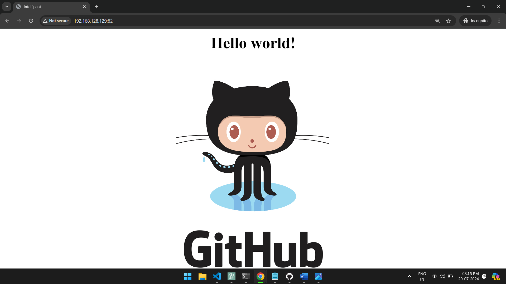

# Containerized Application Deployment with Jenkins and Docker

```docker
# Dockerfile

# Use a base image with Apache
FROM debian:latest

# Install Apache
RUN apt-get update && \
    apt-get install -y apache2 && \
    apt-get clean

# Copy website files to the container
COPY . /var/www/html

# Expose port 80
EXPOSE 80

# Start Apache in the foreground
CMD ["apache2ctl", "-D", "FOREGROUND"]
```

```groovy
// Jenkinsfile

pipeline {
    agent any

    environment {
        DOCKER_IMAGE = 'nileshmuthal1317/myproject'
    }

    parameters {
        string(name: 'BRANCH_NAME', defaultValue: 'master', description: 'Branch name to build')
    }

    stages {
        stage('Checkout') {
            steps {
                git branch: "${params.BRANCH_NAME}", url: 'https://github.com/nileshmuthal1317/cicdproject.git'
            }
        }
        stage('Build Docker Image') {
            when {
                expression { return params.BRANCH_NAME == 'master' }
            }
            steps {
                script {
                    docker.build("${env.DOCKER_IMAGE}:${env.BUILD_ID}")
                }
            }
        }
        stage('Publish Docker Image') {
            when {
                expression { return params.BRANCH_NAME == 'master' }
            }
            steps {
                script {
                    withCredentials([string(credentialsId: 'nileshmuthal1317-dockerhub-token', variable: 'DOCKERHUB_TOKEN')])
 {
                        echo 'Logging in to Docker Hub...'
                        sh 'echo $DOCKERHUB_TOKEN | docker login -u nileshmuthal1317 --password-stdin'

                        echo 'Pushing Docker image to Docker Hub...'
                        sh '''
                        docker push ${DOCKER_IMAGE}:${BUILD_ID}
                        '''

                        echo 'Running Docker container...'
                        sh '''
                        docker run -d -p 82:80 ${DOCKER_IMAGE}:${BUILD_ID}
                        '''
                    }
                }
            }
        }
        stage('Notify') {
            when {
                expression { return params.BRANCH_NAME == 'develop' }
            }
            steps {
                echo 'Build successful, not publishing'
            }
        }
    }

    post {
        always {
            cleanWs()
        }
    }
}
```


