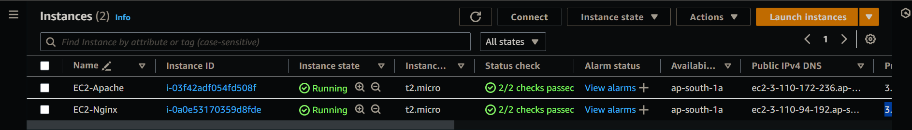
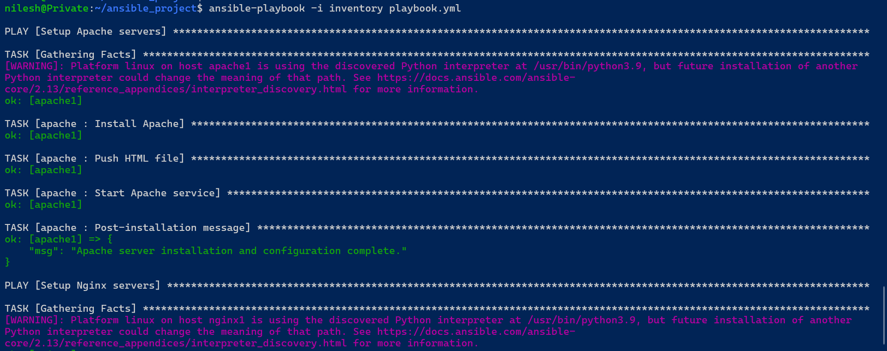
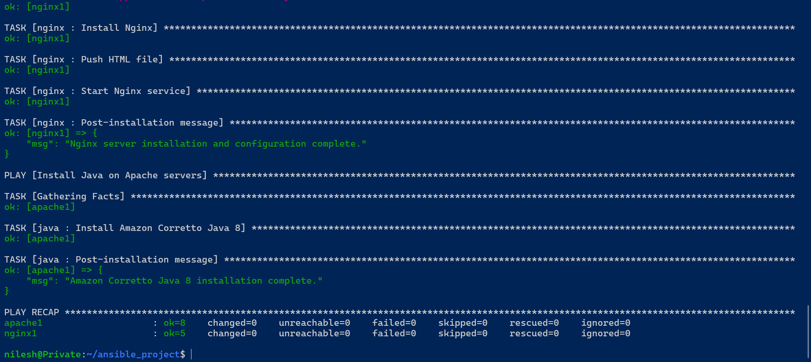
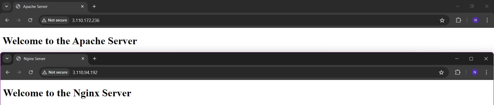

# Automating Web Server Setup with Ansible

### Project Description

In this project, I utilized Ansible to configure two EC2 instances for web server deployment. The objective was to set up an Apache server on one instance and an Nginx server on another, while also installing Java on the Apache server.

### Key Tasks:

- **Apache Configuration**:
    - Installed the Apache HTTP server.
    - Deployed a custom HTML file for server information.
    - Ensured the Apache service is started and enabled to run on boot.
- **Nginx Configuration**:
    - Installed the Nginx server.
    - Deployed a custom HTML file for server information.
    - Ensured the Nginx service is started and enabled to run on boot.
- **Java Installation**:
    - Installed Amazon Corretto Java 8 on the Apache server instance for any Java-based applications.

The project leverages Ansible roles to maintain a modular and reusable structure, making it easy to manage and scale as needed.

### Apache Role (`roles/apache/tasks/main.yml`)

```yaml
# Installed Apache (httpd).
# Pushed a custom HTML file for server information.
# Started the Apache service and ensured it runs on boot.
# Delivered a post-installation message to confirm completion.

- name: Install Apache
  yum:
    name: httpd
    state: present

- name: Push HTML file
  copy:
    src: server_info_apache.html
    dest: /var/www/html/index.html

- name: Start Apache service
  service:
    name: httpd
    state: started
    enabled: yes

- name: Post-installation message
  debug:
    msg: "Apache server installation and configuration complete."
```

### Nginx Role (`roles/nginx/tasks/main.yml`)

```yaml
# Installed Nginx.
# Uploaded an HTML file for server information.
# Started the Nginx service and set it to start on boot.
# Provided a confirmation message after installation.

- name: Install Nginx
  yum:
    name: nginx
    state: present

- name: Push HTML file
  copy:
    src: server_info_nginx.html
    dest: /usr/share/nginx/html/index.html

- name: Start Nginx service
  service:
    name: nginx
    state: started
    enabled: yes

- name: Post-installation message
  debug:
    msg: "Nginx server installation and configuration complete."
```

### Java Role (`roles/java/tasks/main.yml`)

```yaml
# Installed Amazon Corretto Java 8 on the Apache server group.
# Sent a post-installation message upon successful installation.

- name: Install Amazon Corretto Java 8
  yum:
    name: java-1.8.0-amazon-corretto
    state: present

- name: Post-installation message
  debug:
    msg: "Amazon Corretto Java 8 installation complete."
```

### Playbook (`playbook.yml`)

```yaml
# Created a structured playbook to manage the installation processes for both servers efficiently.

- name: Setup Apache servers
  hosts: apache_servers
  become: true
  roles:
    - apache

- name: Setup Nginx servers
  hosts: nginx_servers
  become: true
  roles:
    - nginx

- name: Install Java on Apache servers
  hosts: apache_servers
  become: true
  roles:
    - java
```

### Inventory (`inventory`)

```
# I defined my server groups in an inventory file, ensuring easy management of host configurations.

[apache_servers]
apache1 ansible_host=3.110.172.236 ansible_user=ec2-user ansible_ssh_private_key_file=~/.ssh/SSH_Access.pem ansible_become=true

[nginx_servers]
nginx1 ansible_host=3.110.94.192 ansible_user=ec2-user ansible_ssh_private_key_file=~/.ssh/SS
```

### Project Screenshots







